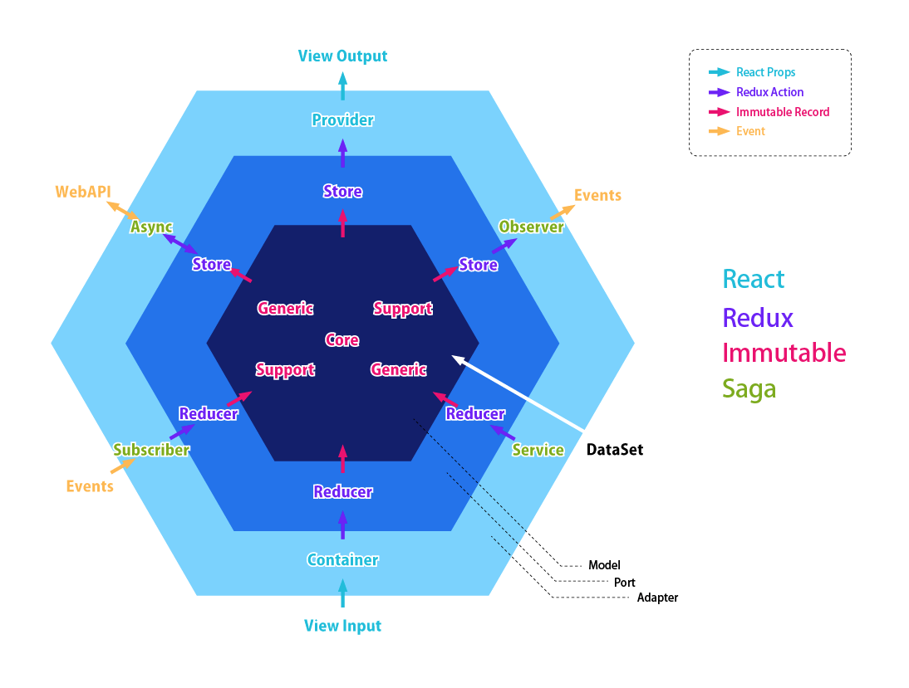

# Coding Rules

## Domain Driven Design のすゝめ

You had better select DDD architecture if select this template.

I'm aware of _domain_ and _ubiquitous languare_ to make this template.

### Hexagonal Architecture



## Stateless Functional Component のすゝめ

If you have the following code (no use lifecycle method)

```javascript
import { Component } from 'react'

class SomeComponent extends Component {
  constructor (props) {
    super(props)
  }
  render () {
    const { someValue } = this.props
    return (
      <div>something...</div>
    )
  }
}
```

I recommend the following expression

```javascript
function SomeStatelessFunctionalComponent (props) {
  const { someValue } = props
  return (
    <div>something...</div>
  )
}
```

### pros

* better readability because of pure function
* easy test
* not affected by changing lifecycle specification

### cons

cannot use ...

* lifecycle method
* refs
